# Installing Ubuntu in VMware Player on Windows

## EXP.NO: 2

## AIM:

To Assemble the Computer System

## PROCEDURE:

### Step 1: 
Once you have the VirtualBox downloaded, install it:

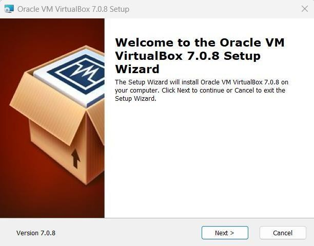

Click Next>:

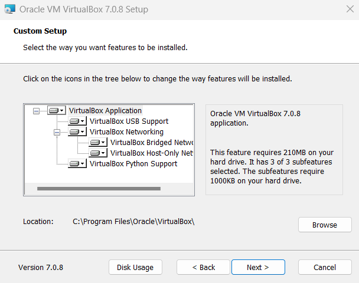

Select the way in which you want features to be installed. Then, click Next>:

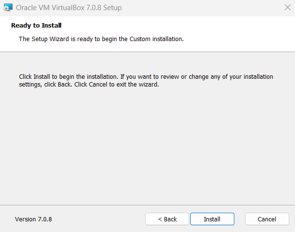

Click Install:

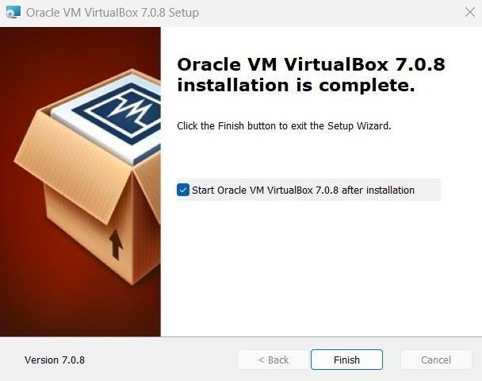

Click Finish:

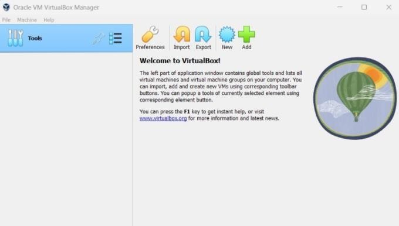

Your VirtualBox is installed and ready to use!

### Step 2: 
Now, go to Machine > New:
–Write the Name you want for your system, for example: Linux Mint
–Select Type: Linux.
–Select Version: Ubuntu.

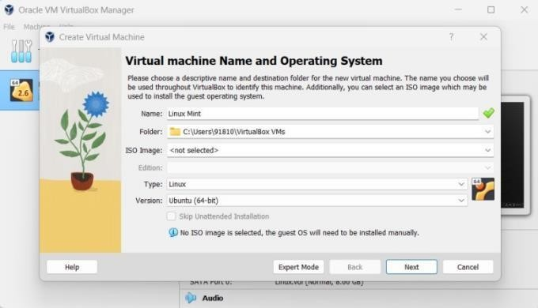

Click Next>:

### Step 3: 
Select the amount of RAM

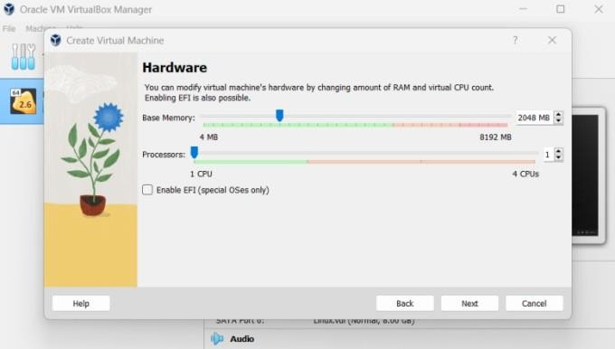

Click Next>:

### Step 4: 
Select hard disk setting:
–Choose ‘Create a virtual hard drive Now’, in order to make a virtual disk space.
–Select the amount of hard drive size.

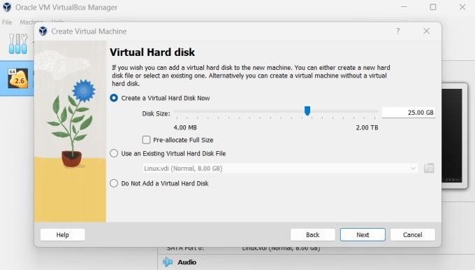

Click Next>:

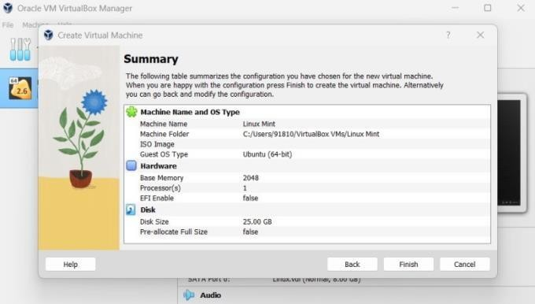

Click Finish.

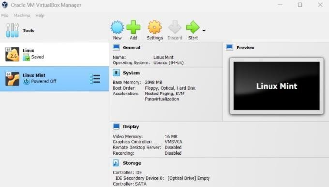

### Step 5: 
Choose the downloaded Linux ISO file:
–Click Start to launch your system.

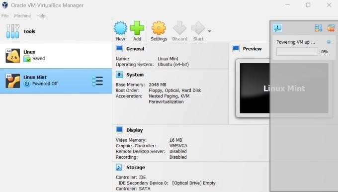

–Choose your iso file from your computer.

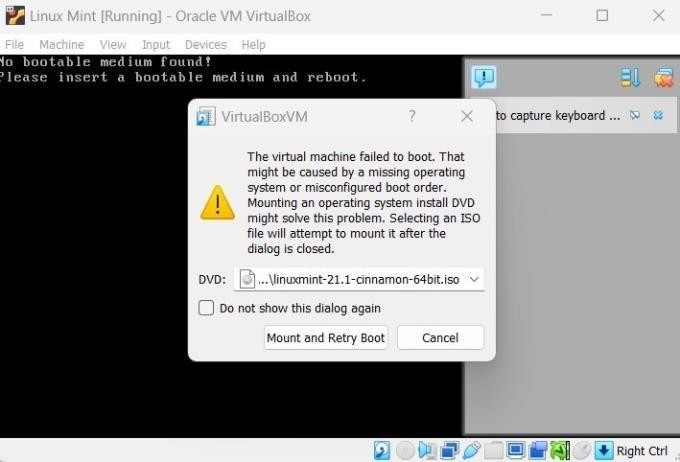

Click Mount and Retry Boot:

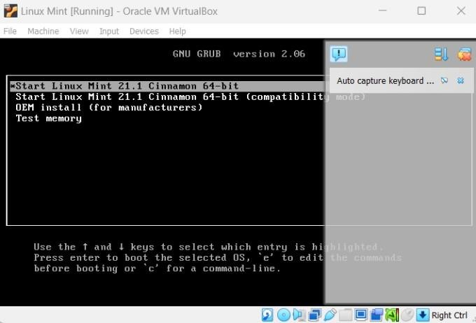

Press Enter.

### Step 6: 
Install Linux
–Click Install Linux Mint:

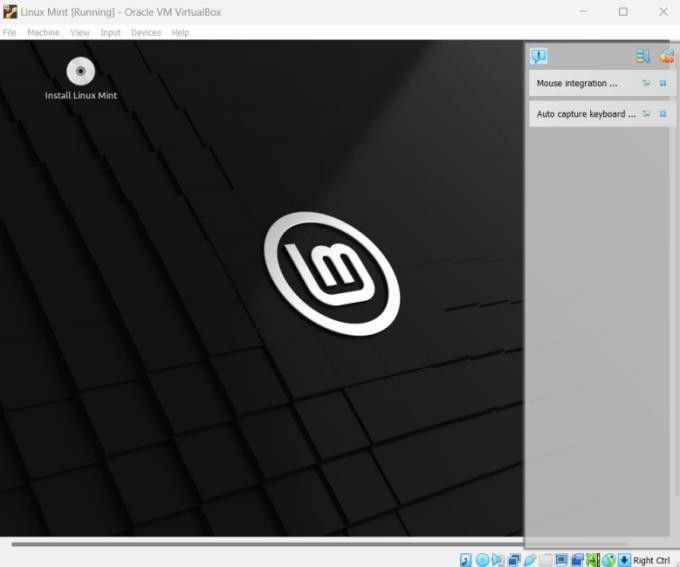

Keep clicking on Continue:

Keep clicking on Continue:

### Step 7: 
Make your Account:
–Enter your details as shown below.

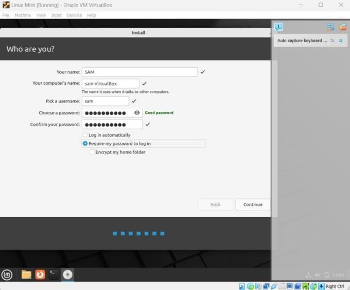

Click Continue:

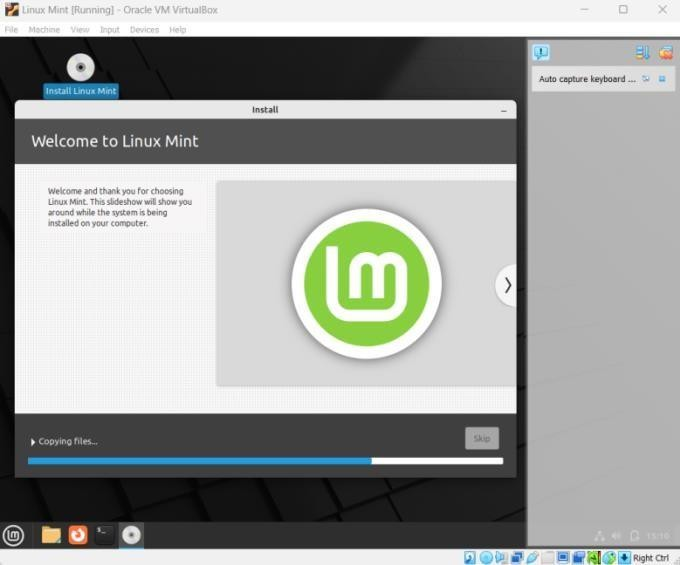

We now have Linux on your Windows using a VirtualBox!

## RESULT:
Ubuntu in VMware Player on Windows has been installed successfully
